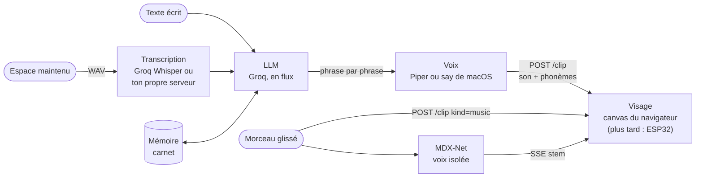

<div align="center">

<picture>
  <source media="(prefers-color-scheme: light)" srcset="assets/hero-light.svg">
  
</picture>

# Eli

**Un visage pour ton LLM.** Un petit robot vert sur noir qui parle avec de vraies lèvres, te regarde,
s'assoupit quand tu l'oublies et chante sur ta musique.

<a href="#demarrer"></a>&nbsp;
<a href="#visages"></a>&nbsp;
<a href="#protocole"></a>&nbsp;
<a href="#feuille-de-route"></a>

<br>


[English](README.md) · Français

</div>

---

Eli, c'est un visage qui parle, à brancher sur un LLM. Tu maintiens <kbd>Espace</kbd>, tu dis quelque chose, et un
petit visage d'écran OLED te répond à voix haute, la bouche formée par les phonèmes qu'il prononce vraiment. Laisse-le
tranquille : il regarde ailleurs, fredonne, bâille, puis finit par s'endormir en ronflant au rythme de sa respiration.
Lâche-lui un morceau : il danse sur le tempo, puis chante la voix isolée, les yeux qui se ferment sur les notes aiguës.

Aujourd'hui, il vit dans ton navigateur, servi par un petit serveur Python (bibliothèque standard). Demain, le même
visage passe sur un **ESP32** avec un OLED 128×64 : le cerveau ne parle au visage que par un
[petit protocole HTTP](#protocole), alors remplacer la page par une carte, c'est changer une URL.

## Ce qu'il sait faire

<table>
  <tr>
    <td align="center" width="33%"><br><b>Parle avec de vraies lèvres</b><br><sub>Bouche pilotée par le son <i>et</i> les phonèmes alignés de Piper (visèmes), 100 images par seconde.</sub></td>
    <td align="center" width="33%"><br><b>T'écoute quand tu tiens Espace</b><br><sub>Appuyer pour parler, grands yeux, petits hochements. Parle par-dessus : il se tait et lâche sa réponse.</sub></td>
    <td align="center" width="33%"><br><b>Chante et danse</b><br><sub>Glisse un morceau : il rebondit sur le tempo, isole la voix avec un modèle MDX et chante dessus.</sub></td>
  </tr>
  <tr>
    <td align="center"><br><b>S'endort</b><br><sub>Petits gestes, puis somnolence, puis sommeil : respiration, Zzz et ronflement synthétisé.</sub></td>
    <td align="center"><br><b>Peut être un chat</b><br><sub>Les visages de chat frémissent des oreilles, miaulent tout seuls et ronronnent en dormant.</sub></td>
    <td align="center"><br><b>14 visages</b><br><sub>Pixels d'OLED, blocs, perles, traits pour écran rond, néon, matrice de LED, oscillo, chats.</sub></td>
  </tr>
</table>

**Et aussi**

- **Répond en flux.** Le LLM répond en streaming et chaque phrase est dite dès qu'elle est finie : les premiers mots sortent pendant que la suite s'écrit.
- **Se souvient de toi.** La conversation survit aux redémarrages, et après un moment de calme le LLM la résume dans un carnet de faits durables en texte brut (`memory/souvenirs.md`, un fait par ligne, modifiable à la main).
- **Se présente.** Au premier lancement, Eli te demande ton prénom et te pose quelques questions pour faire connaissance.
- **Parle français ou anglais.** `ELI_LANG=auto` suit la langue de ton navigateur (Réglages → Langue la force) : personnalité, phrases toutes faites, voix, transcription et mot de réveil changent ensemble.
- **Prononce bien l'anglais.** En français, les mots anglais entourés de `[en]…[/en]` sont dits avec des phonèmes anglais, dans la même voix : les titres de morceaux ne sortent plus à la française.
- **Voix de chat, en option.** Un filtre plus aigu, qui ne s'applique que quand un visage de chat est à l'écran.
- **Ta bibliothèque musicale.** Branche Navidrome ou n'importe quel serveur Subsonic, puis dis « Eli, mets du Daft Punk » ou choisis un morceau dans la **Bibliothèque** (♪ dans le dock, <kbd>M</kbd>) : recherche, pochettes, lecture aléatoire. Eli s'habille selon le genre (lunettes et palmiers pour le tropical, lasers pour l'électro…).
- **Karaoké.** Pendant qu'il chante, un lecteur sous le visage montre la ligne en cours (paroles synchronisées via [LRCLIB](https://lrclib.net)), la suivante, et permet de mettre en pause, de te déplacer dans le morceau, et de passer au précédent ou au suivant (au-delà du dernier, un morceau au hasard). Active la **lecture continue** (⇄) et il enchaîne au hasard quand un
  morceau se termine. Il annonce les morceaux que tu choisis (« Voici Maps, de Maroon 5 »), ce qui couvre aussi les quelques secondes que sa voix isolée met à démarrer.
- **Jamais coincé sur un modèle mort.** Si Groq retire le modèle avec lequel Eli réfléchit, il passe à un modèle encore servi ; Réglages → Cerveau liste ceux que propose ton serveur pour en choisir un autre.
- **Choisis sa couleur.** Vert, blanc, bleu ou jaune, comme les écrans OLED qu'on trouve dans le commerce, ou n'importe quelle couleur : pratique pour choisir un écran avant de l'acheter.
- **Une seule voix à la fois.** Ouvre Eli dans un navigateur, l'app Mac et un téléphone : l'écran utilisé en dernier parle, les autres se taisent.
- **Mode développeur.** Un journal en direct de la page et du serveur, et un diagnostic en un clic (secrets masqués) à coller dans un ticket.
- **Pilotable depuis le terminal** avec [`./send.sh`](#depuis-le-terminal), par le même protocole que l'ESP32.

<a id="demarrer"></a>

## Démarrer

**Sur Mac (Apple Silicon, macOS 13+) :** télécharge le `.dmg` de la [dernière release](https://github.com/adrbn/eli/releases/latest),
glisse Eli dans Applications, ouvre-le. Rien d'autre à installer : au premier lancement Eli te demande sa voix (tu
les entends toutes tout de suite, seule celle que tu gardes se télécharge), un cerveau (une clé Groq gratuite, ou ton propre modèle local) et le micro, puis se présente. Les mises à jour s'installent toutes seules.

**Depuis les sources**, partout : il te faut [`uv`](https://docs.astral.sh/uv/), une [clé API Groq](https://console.groq.com/keys) (gratuite), et `ffmpeg` si tu veux qu'il chante.

```bash
git clone https://github.com/adrbn/eli && cd eli
cp .env.example .env        # puis mets ta GROQ_API_KEY dedans
./run.sh
```

C'est tout. `http://127.0.0.1:5280` s'ouvre, Eli se réveille et se présente.
Le premier lancement télécharge une voix Piper (~60 Mo) et le modèle qui isole les voix (~65 Mo).
`./run.sh --no-open` démarre le serveur sans ouvrir le navigateur.

> [!TIP]
> Dans Safari, **Fichier › Ajouter au Dock** en fait une vraie fenêtre d'app. Les navigateurs veulent un clic avant de
> jouer du son : si besoin, un bandeau « Clique pour réveiller Eli » s'affiche.

## Les apps natives

**macOS** (`apps/macos`, sans projet Xcode, il faut les outils en ligne de commande Xcode) :

```bash
apps/macos/build.sh             # → apps/macos/build/Eli.app qui lance le serveur du repo, signée avec ton Developer ID
BUNDLE=1 apps/macos/build.sh    # autonome : Python, serveur et ffmpeg dans l'app
apps/macos/release.sh 0.2.0     # DMG notarisé + appcast Sparkle, demande avant de publier la release GitHub
```

`Eli.app` lance le serveur si rien ne répond sur le port (et l'arrête en quittant, seulement si c'est elle qui l'a
lancé), trouve le dépôt quand l'app est rangée dedans, sinon demande le dossier une fois. C'est une app comme les
autres (Dock, menus natifs, pas d'icône dans la barre des menus), et Eli vit à un seul endroit à la fois, depuis le
menu **Présentation** :

- **Fenêtre** <kbd>⌘1</kbd> : la page complète, sans la bordure.
- **Flottant** <kbd>⌘2</kbd> : juste le visage, au-dessus de tes fenêtres ; tu le déplaces où tu veux, il s'aimante
  aux bords et aux coins, se redimensionne par le coin ou en pinçant, un double-clic ouvre la fenêtre.
- **Encoche** <kbd>⌘3</kbd> : sur un MacBook à encoche, Eli s'y installe. Survole pour avoir le champ de texte, les
  commandes du morceau, les paroles et les réglages.

Fermer la fenêtre envoie Eli dans l'encoche (ou dans le visage flottant sur les Mac sans encoche) ; <kbd>⌘Q</kbd>
quitte. Le menu **Musique** ouvre la bibliothèque (<kbd>⌘B</kbd>), lance/met en pause (<kbd>⌘P</kbd>), passe au
morceau précédent ou suivant, arrête le morceau ou juste sa voix (<kbd>⌘.</kbd>). Le menu **Développeur** active le
mode développeur, copie le diagnostic (<kbd>⌥⌘D</kbd>), ouvre le journal du serveur ou la page dans ton navigateur,
et recharge.
La sortie du serveur va dans `~/Library/Logs/Eli/server.log` ; autre port : `defaults write com.adrbn.eli.mac port 5281`.
Garde `HOST` sur `127.0.0.1` ou `0.0.0.0` : l'app parle à `127.0.0.1`.

**iPhone** (`apps/ios`, il faut [`xcodegen`](https://github.com/yonaskolb/XcodeGen)) : `cd apps/ios && xcodegen`,
ouvre `Eli.xcodeproj`, choisis ton équipe, lance. Au premier lancement, tape l'adresse de l'ordinateur où tourne
Eli (par exemple son IP Tailscale, `100.x.y.z:5280`). Son `HOST` dans `.env` doit être joignable depuis le
téléphone (`0.0.0.0`, ou cette IP). L'app relaie le serveur par `127.0.0.1` sur le téléphone, ce qui permet au
micro de marcher en http simple. Appui long à deux doigts pour changer d'adresse.

## Les commandes

| Geste | Ce qui se passe |
|---|---|
| Écrire dans la barre, <kbd>Entrée</kbd> | Il réfléchit (yeux qui cherchent en haut), puis répond à voix haute. <kbd>Entrée</kbd> n'importe où place le curseur dans la barre. |
| Commencer le message par `>` | Il dit le texte tel quel, sans passer par le LLM |
| Maintenir <kbd>Espace</kbd> (ou le bouton micro) | Il t'écoute ; au relâchement : transcription → réponse → voix |
| Dire **« Eli, … »** (Réglages → *Écoute permanente*) | Sans les mains. Un petit modèle hors ligne repère ce qui ressemble à son nom ; seuls ces bouts sont transcrits. « Eli » tout seul : il ouvre grand les yeux et attend la suite |
| Parler pendant qu'il parle | Il se tait et abandonne sa réponse |
| Glisser un fichier audio sur la fenêtre | Zone **Parler** : la bouche suit la voix. Zone **Chanter** : il danse, puis chante sur la voix isolée |
| Bouger la souris | Son regard te suit (c'est le capteur, simulé) |
| <kbd>←</kbd> / <kbd>→</kbd> | Visage précédent / suivant |
| <kbd>V</kbd> | Réglages → Visages : la galerie, avec les réglages du « Sur mesure » |
| <kbd>M</kbd> | La bibliothèque : recherche, lecture aléatoire, un clic pour qu'il chante (le serveur se règle dans Réglages → Musique) |
| <kbd>P</kbd> | Lecture / pause du morceau |
| <kbd>C</kbd> | Montrer / cacher les paroles (aussi un bouton dans le lecteur) |
| <kbd>↑</kbd> / <kbd>↓</kbd> | Rappelle les messages déjà envoyés, comme dans un terminal |
| <kbd>Échap</kbd> | Ferme les panneaux et le fait taire (le morceau continue, même s'il télécharge encore) |
| Clic hors d'un panneau | Le ferme |
| Ne rien faire pendant 2 min | Il somnole, puis s'endort une minute plus tard ; n'importe quoi le réveille |

Les **Réglages** (en bas à droite) tiennent dans une feuille avec une barre latérale : **Général** (langue, point du
matin, couper la parole, oublier la conversation), **Voix et écoute** (voix, écoute permanente, voix de chat, volume,
avance de la bouche), **Visages** (galerie, sur mesure, couleur, sous-titres, regard à la souris, bruits du sommeil),
**Musique** (serveur, tenues selon le genre, notes de musique, faire chanter ton fichier), **Cerveau** (clé Groq ou
ton serveur, et le modèle), **Souvenirs** (le carnet, refaire connaissance, tout oublier) et **Développeur**.

## Ta musique (Navidrome / Subsonic)

Eli joue depuis ta propre bibliothèque via l'[API Subsonic](https://www.subsonic.org/pages/api.jsp) : ça marche avec
[Navidrome](https://www.navidrome.org), Airsonic, Gonic ou n'importe quel serveur compatible Subsonic.

1. Ouvre **Réglages → Musique** (ou appuie sur ♪ dans le dock, ou demande simplement « Eli, mets du jazz » : tant
   qu'aucun serveur n'est branché, les deux t'amènent sur ce formulaire).
2. Entre l'adresse du serveur (`http://ton-serveur:4533`), l'utilisateur et le mot de passe. Eli les vérifie avec
   `ping`, puis ne garde qu'un jeton salé (`md5(mot de passe + sel)`, comme le veut le protocole Subsonic) dans
   `local/navidrome.json`, jamais le mot de passe. Le jeton reste sur le serveur : la page récupère les pochettes et
   les morceaux par Eli, pas directement depuis Navidrome.
3. Ensuite ♪ (ou <kbd>M</kbd>) ouvre la **Bibliothèque** : cherche par titre, artiste ou album, ou clique sur **Au hasard** ; clique un morceau et Eli le chante. À la voix,
   « Eli, mets Get Lucky » ou « mets du Daft Punk » marchent aussi, y compris les duos (« Arijit Singh et Martin
   Garrix »).

Dans **Réglages → Musique**, la section **Serveur** affiche l'adresse, le compte et la version du serveur, **Tester** mesure l'aller-retour, et
**Déconnecter** supprime le jeton. Les morceaux sont diffusés sur ton réseau, donc une liaison lente (un téléphone en
partage de connexion via Tailscale, par exemple) veut dire quelques secondes avant qu'il démarre.

<a id="visages"></a>

## Les visages

Même comportement, rendus différents. Ton choix est mémorisé et partagé entre les pages ouvertes.

| Famille | Id | Rendu | Écran visé |
|---|---|---|---|
| Pixel | `pixel` *(par défaut)* | chaque pixel d'un OLED 128×64 | OLED 0,96″ ou 1,3″ |
| Pixel | `blocs` | gros pixels carrés | OLED 128×64 |
| Pixel | `perles` | pixels en croix | OLED 128×64 |
| Pixel | `perles-fond` | LED rondes, celles éteintes restent visibles | écran couleur |
| Pixel | `grille` | sur mesure : densité, forme (carré / perle) et fond | écran couleur |
| Trait | `trait` | yeux ronds, lèvres | rond 240×240 |
| Trait | `trait-doux` | yeux en rectangles très arrondis, pleins | rond 240×240 |
| Trait | `trait-contour` | la même chose, en contours | rond 240×240 |
| Trait | `trait-neon` | contours lumineux | rond, idéalement AMOLED |
| Chats | `chat-pixel` | chat en pixels, oreilles qui frémissent | OLED 128×64 |
| Chats | `chat-perles` | chat en perles, LED éteintes visibles | écran couleur |
| Chats | `chaton` | grands yeux, joues roses | rond 240×240 |
| Autres | `matrice` | LED rondes 19×19 | rond 240×240 |
| Autres | `oscillo` | trace d'oscilloscope, la bouche est une onde | 4:3, 320×240 |

Les chats miaulent de temps en temps (synthétisé, aucun échantillon) et ronronnent au lieu de ronfler.

<details>
<summary><b>Ajouter ton propre visage</b></summary>

<br>

Une entrée dans `THEMES`, dans [`web/js/themes.js`](web/js/themes.js) :

```js
{ id: 'le-mien', name: 'Le mien', family: 'Autres', screen: 'rect', note: 'à quoi il ressemble', make: () => dessin }
```

`screen` vaut `rect` (2:1), `round` (1:1) ou `wide` (4:3). `make()` renvoie une fonction de dessin
`(ctx, W, H, f, dt)` appelée à chaque image. `f` contient tout l'état du visage, et le comportement ne dépend jamais du rendu :

- `f.eyes = { gx, gy, open, hap, sc, bo }` : regard, ouverture, sourire des yeux, taille, rebond
- `f.mouth = { o, w, r, t }` : ouverture, largeur, arrondi, dents
- `f.T` : le temps, en secondes

Sur l'ESP32, un visage sera exactement ça : une fonction de dessin.

</details>

## Comment ça marche



- **Serveur** (`server/`, Python bibliothèque standard + Piper + onnxruntime) : `app.py` tient le protocole de l'écran, `brain.py` la boucle micro → transcription → LLM → voix, `voice.py` Piper (repli : `say` de macOS), `stems.py` + `mdx.py` l'isolation de la voix, `memory.py` la conversation et le carnet, `meow.py` les miaous synthétisés.
- **Lip sync** (`web/js/analysis.js`, dans un worker) : chaque clip est analysé en entier avant d'être joué. Cinq bandes de fréquences donnent, 100 fois par seconde, l'ouverture, la largeur, l'arrondi (o, ou) et les dents (s, ch, f). Quand la voix fournit les durées des phonèmes (Piper le fait), des visèmes construits dessus prennent le relais. La bouche lit la piste au temps que tu *entends* (latence de sortie comprise), avec 50 ms d'avance comme un vrai locuteur.
- **Regard** (`web/js/face.js`) : il détourne les yeux en commençant une phrase, revient sur toi en la finissant, cligne dans les pauses, fait de petites saccades. Sans capteur, des yeux au centre regardent tout le monde à la fois.
- **Musique** : tempo et temps forts viennent du flux spectral et d'une autocorrélation. Pendant ce temps, MDX-Net (Kim_Vocal_2 d'UVR, en ONNX, sur le CPU) isole la voix bloc par bloc pendant que le morceau joue (à peu près à la vitesse de lecture sur un M1) : il chante dès la première écoute. Les notes aiguës font monter et plisser les yeux, les graves font plonger le regard. Le résultat est mis en cache par empreinte du fichier.
- **Bruits du sommeil** (`web/js/sleep.js`) : ronflement et ronronnement sont synthétisés dans le navigateur, calés sur la respiration du visage.

<a id="protocole"></a>

## Le protocole

Le visage est un écran passif : on lui envoie des clips audio et des états, il joue et anime.
Le cerveau ne lui parle que par ces routes, donc remplacer la page par un ESP32 revient à mettre son adresse dans `FACE_URL`.

```text
POST /clip?kind=speech|music&turn=N&name=f.mp3   corps = fichier audio
                                                  X-Text : texte dit (encodé URL)
                                                  X-Phonemes : [[phonème, ms], …] en JSON encodé URL (facultatif)
POST /stop    {} ou {"turn": N}                   coupe la parole, vide la file ; ignore ensuite les clips des tours < N
              {"keep": "music"}                   … mais le morceau en cours continue
POST /state   {"mode": "idle|listen|think"}       humeur de fond
POST /gaze    {"x": -1..1, "y": -1..1} ou {}      cible du regard (le capteur) ; {} rend le regard libre
POST /theme   {"id": "pixel"}                     change de visage
GET  /events                                      flux SSE vers l'affichage
GET  /clips/<id>, /stems/<empreinte>.wav          octets audio (/clips/<id>?compat=1 : converti en MP3 ;
                                                  /stems : la voix isolée, partielle tant qu'elle se calcule)
```

Événements SSE : `hello` (état complet à la connexion), `clip`, `stem` (voix isolée d'un morceau, bloc par bloc),
`lyrics` (paroles synchronisées d'un morceau), `genre` (sa tenue), `state`, `gaze`, `theme`, `voice`, `lang`, `take`,
`music`, `setup`, `stop` et `brain` (étapes de la conversation, pour l'affichage : `stt`, `heard`, `llm`, `music`,
`fetch`, `done`, `error`).

**Les tours.** Chaque réponse du cerveau commence par `POST /stop {"turn": N}`. L'écran se tait et jette les clips
encore en route des tours précédents : une réponse interrompue ne revient jamais parler par-dessus la suivante.

Le cerveau, servi par le même processus :

```text
POST /brain/listen   corps = WAV du micro     → transcription → réponse → voix
POST /brain/chat     {"text": "…"}            → réponse → voix
POST /brain/speak    {"text": "…"}            → voix seulement (dit exactement ce texte)
POST /brain/reset    (?all=1 : le carnet aussi)   oublie la conversation
POST /brain/intro                             les présentations
POST /brain/meow                              un miaou (visages de chat)
POST /voice          {"id": "…"} / {"cat": true}   choisit une voix / active la voix de chat
POST /lang           {"lang": "en|fr"}        la langue de la page (voix, présentations, point du matin)
POST /take           {"client": "…"}          cet écran parle maintenant, les autres se taisent (événement « take »)
GET  /api/status, /api/voices, /api/memory
GET  /api/logs?after=N                        les dernières lignes du journal serveur (mode développeur)

POST /music/setup    {"url", "user", "password"}   connecte un serveur Subsonic (seul un jeton est gardé)
POST /music/forget   POST /music/ping              déconnecte / teste le serveur
POST /music/play     {"id": "…"}             chante ce morceau de la bibliothèque (il l'annonce d'abord)
POST /music/prev     POST /music/next          les morceaux chantés, dans un sens ou l'autre (un au hasard au-delà du dernier)
GET  /api/music, /api/music/songs?q=…        statut / recherche (q vide = morceaux au hasard)
GET  /music/cover/<id>                       pochette, en relais
```

Le serveur n'écoute que sur `127.0.0.1`. Pour un ESP32 sur ton réseau, `HOST=0.0.0.0` ; les noms d'hôte inconnus et
les requêtes venues d'autres sites sont déjà refusés.

<a id="depuis-le-terminal"></a>

## Depuis le terminal

```bash
./send.sh dis "Bonjour !"          # le dit tel quel
./send.sh demande "Ça va ?"        # question au LLM, réponse à voix haute
./send.sh parle voix.wav           # joue un fichier, la bouche suit
./send.sh chante morceau.mp3       # danse et chante
./send.sh regarde 0.6 -0.2         # oriente le regard (x, y entre -1 et 1) ; sans valeurs : regard libre
./send.sh visage trait-neon        # change de visage
./send.sh humeur think             # humeur : idle, listen ou think
./send.sh stop                     # coupe la parole
./send.sh oublie                   # efface la conversation
```

`ELI_URL=http://…` vise un autre serveur.

## Réglages

Tout est dans `.env` (modèle : [`.env.example`](.env.example)). Il faut un cerveau : `GROQ_API_KEY` (offre gratuite, ta propre clé) ou `LLM_URL`.

| Variable | Par défaut | Rôle |
|---|---|---|
| `GROQ_API_KEY` | | transcription et LLM |
| `STT_PROVIDERS` | `groq,echo` | ordre des moteurs de transcription, le suivant prend le relais en cas d'échec |
| `ECHO_URL`, `ECHO_API_KEY` | | ton propre serveur `/v1/audio/transcriptions` au format OpenAI (Parakeet à la maison, par ex.) |
| `ELI_LANG` | `auto` | la langue d'Eli : `fr`, `en`, ou `auto` (celle du navigateur de la page ; Réglages → Langue la force) |
| `STT_LANGUAGE` | *(suit `LANG`)* | langue de la transcription, s'il faut qu'elle diffère |
| `LLM_MODEL`, `LLM_FALLBACK_MODEL` | `openai/gpt-oss-120b`, `openai/gpt-oss-20b` | modèles Groq |
| `LLM_URL`, `LLM_API_KEY` | | un cerveau local compatible OpenAI à la place (mlx_lm.server, Ollama…) |
| `TTS`, `SAY_VOICE` | `piper`, `Thomas` | voix de départ (Siwis en français, Kristin en anglais) ; elle se change à chaud dans Réglages, un choix par langue |
| `SEPARATOR_MODEL` | `voices/Kim_Vocal_2.onnx` | le modèle qui isole la voix |
| `HOST`, `PORT` | `127.0.0.1`, `5280` | où le serveur écoute |
| `FACE_URL` | *(ce serveur)* | où le cerveau envoie ses clips : plus tard, l'ESP32 |
| `BRIEF_CITY` | | ville de la météo du point du matin (Open-Meteo, sans clé) |
| `ALLOWED_HOSTS` | | noms servis en plus des IP et de localhost (ex. derrière `tailscale serve`) |
| `NAVIDROME_URL`, `_USER`, `_PASSWORD` | | ta bibliothèque musicale ; plus simple depuis le panneau Musique |
| `LYRICS` | `on` | paroles synchronisées via LRCLIB pendant qu'il chante (`off` = ne jamais les demander) |

La personnalité d'Eli est dans `DEFAULT_PERSONA` (`server/brain.py`, une par langue) ; crée un `persona.txt` à la racine pour la remplacer (il sert dans les deux langues, et Eli reçoit la consigne de la langue où répondre).

## Sur un serveur maison (Docker)

Le même serveur tourne sur un NAS ou un mini-PC (Linux, amd64 ou arm64 en 64 bits), et chaque téléphone, tablette ou
ordinateur de la maison ouvre le visage dans son navigateur.

```bash
git clone https://github.com/adrbn/eli && cd eli
cp .env.example .env              # mets ta GROQ_API_KEY dedans
mkdir -p voices memory cache local  # créés par toi, pour que le conteneur (uid 1000) puisse y écrire
docker compose up -d --build
docker compose logs -f            # attends « voice: piper · Siwis » puis « Eli listening on … »
```

- Le premier démarrage télécharge la voix Piper et le modèle qui isole les voix (~130 Mo) dans `voices/`. Si tu viens
  d'un Mac, copie d'abord ton dossier `memory/` (et `voices/` pour éviter les téléchargements) : Eli reprend où il en était.
- Ton uid sur le serveur n'est pas 1000 ? Ajoute `ELI_UID=…` et `ELI_GID=…` (donnés par `id -u` et `id -g`) dans `.env`.
- Garde `TTS=piper`, et supprime `voices/choix.txt` s'il désigne une voix `say:` : les voix macOS n'existent pas sous Linux.
- **Le chant consomme beaucoup de CPU** : isoler la voix d'un morceau fait tourner un modèle ONNX sur 4 fils, avec un pic
  autour de 2,5 Go de RAM (un M1 met ~0,8× la durée du morceau ; un petit processeur peut prendre du retard sur la
  lecture). `SEPARATOR_MODEL=off` dans `.env` le coupe (Eli danse toujours), et la limite de mémoire de `compose.yaml`
  peut alors descendre à 1 Go.
- Eli n'a **pas de mot de passe** : quiconque atteint le port peut le faire parler et lire son carnet. Garde-le sur ton
  réseau local ou ton VPN, et n'ouvre jamais le port sur internet.

**Depuis un téléphone ou une tablette**, ouvre `http://<ip-du-serveur>:5280`, sur le réseau local ou à travers un VPN
comme Tailscale ou WireGuard. Utilise l'adresse IP : Eli ne répond qu'aux adresses IP et à `localhost` (une protection
contre le DNS rebinding), donc un nom comme `nas.local` reçoit une erreur 403.

En `http://` simple, tout marche sauf le **micro** (Espace maintenu et le mot de réveil) : les navigateurs n'autorisent
`getUserMedia` que dans un contexte sécurisé, c'est-à-dire en HTTPS ou sur `localhost`. Tu peux toujours écrire. Pour le
micro, mets du HTTPS devant Eli, sur la même IP :

- **Un reverse proxy avec TLS**, par exemple [Caddy](https://caddyserver.com) avec sa propre autorité de certification
  locale. Il garde l'en-tête `Host` du navigateur, qu'Eli compare à `Origin` :

  ```caddy
  # l'IP du serveur sur le réseau local ou le VPN ; reverse_proxy eli:5280 si Caddy tourne dans le même compose
  https://192.168.1.50:5443 {
      tls internal
      reverse_proxy 127.0.0.1:5280
  }
  ```

  Installe ensuite une fois le certificat racine de Caddy (`pki/authorities/local/root.crt` dans son dossier de
  données) sur chaque appareil, fais-lui confiance, et ouvre `https://192.168.1.50:5443`.
- **`tailscale serve`** donne un vrai certificat sans rien régler, sur un nom en `*.ts.net`. Par défaut Eli ne sert que
  les adresses IP et `localhost` (garde-fou contre le DNS rebinding) : nomme-le dans `.env`,
  `ALLOWED_HOSTS=eli.ton-tailnet.ts.net`.
- Pour un essai rapide, Chrome (ordinateur et Android) peut traiter une origine comme sécurisée :
  `chrome://flags/#unsafely-treat-insecure-origin-as-secure`.

## Vers l'ESP32

- **Carte** : ESP32-S3 avec PSRAM (tampons audio), ampli I2S MAX98357A et un petit haut-parleur.
- **Écran** : OLED SSD1306 / SH1106 128×64 pour la famille Pixel (`pixel`, `blocs` et `perles` y tiennent pixel pour pixel). Rond GC9A01 240×240 pour les traits et la matrice. De l'AMOLED pour le néon et les LED visibles.
- **Bouche** : l'idée est que le serveur calcule la piste de bouche (le même `analysis.js`) et l'envoie avec le clip ; la carte n'a plus qu'à jouer le son et lire la piste à 100 images/s.
- **Regard** : un radar mmWave LD2450 donne la position x/y des gens, sans caméra ; une caméra avec détection de visage marche aussi. Dans les deux cas : `POST /gaze`.

## Matériel / ESP32

[`firmware/esp32/`](firmware/esp32/) est un firmware PlatformIO qui fait d'un ESP32-S3 (avec PSRAM) un visage
interchangeable avec la page. Il répond à `/clip`, `/stop`, `/state`, `/gaze` et `/theme` : il suffit de régler
`FACE_URL=http://eli.local`. Il dessine la famille Pixel sur un OLED 128×64 (conseillé : le SSD1309 2,42" vert),
parle via un MAX98357A avec une bouche qui suit les phonèmes, et peut tourner la tête sur deux servos et faire du
push-to-talk avec un INMP441. Son [README](firmware/esp32/README.md) (en anglais) donne le câblage, la liste
d'achats (environ 35 à 55 € sur AliExpress) et le calibrage des servos. **Le firmware n'a encore été ni compilé ni
essayé sur du matériel.** La musique (MP3) n'est pas jouée sur la carte.

<a id="feuille-de-route"></a>

## Feuille de route

- [x] Simulateur dans le navigateur, avec le protocole de l'ESP32
- [x] Lip sync par phonèmes, réponses en flux, interruption
- [x] Chant sur la voix isolée, danse sur le tempo
- [x] Mémoire qui se consolide, présentations au premier lancement
- [x] Visages de chat, miaous, ronronnements
- [x] Karaoké avec paroles synchronisées (LRCLIB)
- [x] Mot de réveil : dis « Eli, … » sans les mains (filtre local Vosk, puis tes oreilles confirment ; Réglages → écoute permanente)
- [x] Émotions : le LLM balise ses phrases ([joie], [colère]…) et les yeux et la bouche les jouent
- [x] « Eli, mets du Daft Punk » : ta bibliothèque Navidrome/Subsonic ; Eli ouvre le bon formulaire la première fois
- [x] Bibliothèque : recherche, pochettes, lecture aléatoire, lecture continue ; test et déconnexion du serveur
- [x] Tenues selon le genre, avec des fonds qui restent derrière le visage
- [x] Cerveau local : tout serveur compatible OpenAI (`LLM_URL`, par ex. mlx_lm.server ou Ollama)
- [x] Version serveur maison (Docker)
- [x] Le point du matin
- [x] Français et anglais, interface comprise
- [x] App Mac native (fenêtre, flottant, encoche) et app iPhone
- [x] Mode développeur : journaux en direct et diagnostic pour les rapports de bug
- [x] Choisis la couleur d'Eli
- [ ] Mods de la communauté : partager visages et personnages en un clic, compétences via MCP
- [ ] Version ESP32 + cou motorisé (servo)
- [ ] Plusieurs Eli qui se parlent entre eux

## FAQ

<details>
<summary><b>Qu'est-ce qui sort de ma machine ?</b></summary>

<br>

Le visage, la voix (Piper), le lip sync, l'isolation de la voix et la mémoire restent en local. Deux choses partent chez
Groq par défaut : ta question enregistrée (pour la transcription) et la conversation (pour le LLM). Avec
`STT_PROVIDERS=echo,groq` et ton propre serveur de transcription, ta voix reste à la maison, au prix de ~2 s d'attente en plus.

</details>

<details>
<summary><b>Il parle anglais ?</b></summary>

<br>

Oui : mets `ELI_LANG=en` (ou garde `ELI_LANG=auto` avec un navigateur en anglais, ou choisis-le dans Réglages → Langue). Eli
répond alors en anglais avec une voix Piper anglaise (Kristin par défaut, ~60 Mo, téléchargée au premier passage),
transcrit en anglais et se réveille sur « Eli » avec le modèle Vosk anglais. Si ton `.env` dit encore
`STT_LANGUAGE=fr`, vide-le pour que la transcription suive la langue. En français, les mots anglais au milieu d'une
phrase sont bien prononcés grâce aux balises `[en]`.

</details>

<details>
<summary><b>Je peux utiliser un autre LLM ?</b></summary>

<br>

N'importe quel modèle hébergé chez Groq, via `LLM_MODEL`. Les appels sont du HTTP au format OpenAI : pour un autre
fournisseur compatible, il suffit de changer l'URL `GROQ` dans `server/brain.py`.

</details>

<details>
<summary><b>Il faut un GPU ?</b></summary>

<br>

Non. L'isolation de la voix tourne sur le CPU avec onnxruntime, environ 1,8 fois plus vite que le temps réel sur un Mac
Apple Silicon, un morceau à la fois, mis en cache par empreinte. Sans `ffmpeg` ou sans le modèle, Eli danse quand même,
il ne chante juste pas.

</details>

<details>
<summary><b>Seulement sur Mac ?</b></summary>

<br>

Il est développé et testé sur macOS. Le serveur est du Python standard et Piper tourne partout ; sous Linux, lance
`./run.sh --no-open` et ouvre la page toi-même. Les voix `say` n'existent que sur macOS.

</details>

<details>
<summary><b>Limites connues</b></summary>

<br>

- Le premier appui sur <kbd>Espace</kbd> ouvre le micro et peut manger la première syllabe ; le micro reste ensuite ouvert 30 s.
- Fenêtre cachée ou réduite : l'animation se fige (le son continue).
- Certains morceaux n'ont pas de paroles synchronisées sur LRCLIB : le lecteur affiche alors juste le titre.
- L'isolation de la voix tourne à peu près à la vitesse de lecture sur un M1, plus lentement si le Mac est occupé. En
  attendant qu'elle rattrape, sa bouche suit les paroles synchronisées et le volume du morceau (donc pas de paroles +
  pas encore de voix isolée = bouche fermée).
- La capture micro passe par `ScriptProcessor` : déprécié mais présent partout, à remplacer par un `AudioWorklet`.

</details>

## Signaler un bug

Réglages → Mode développeur affiche un journal en direct de la page et du serveur. **Copier le diagnostic** (ou
<kbd>⌥⌘D</kbd> dans l'app Mac) met les versions, les réglages et les deux journaux dans le presse-papiers, avec les
clés et mots de passe masqués : colle-le dans un
[rapport de bug](https://github.com/adrbn/eli/issues/new?template=bug.yml).

## Tests

```bash
uv run python -m unittest discover server
node --test 'web/tests/*.test.mjs'
```

Les illustrations de ce README sont générées à partir du code des visages : `python3 assets/make_svgs.py`.

## Licence

[MIT](LICENSE) © 2026 adrbn

Téléchargés au premier lancement, sous leurs propres conditions : la voix Siwis de [Piper](https://github.com/rhasspy/piper)
(SIWIS French Speech Synthesis Database, CC BY 4.0), la voix anglaise Kristin de Piper (entraînée sur des
enregistrements LibriVox, domaine public ; les autres voix anglaises proposées, Cori, Norman, John et Joe, sont aussi
dans le domaine public ou CC0), les petits modèles français et anglais (US) de [Vosk](https://alphacephei.com/vosk/models)
(Apache 2.0), et le modèle d'isolation de voix Kim_Vocal_2 d'UVR (aucune licence indiquée par ses auteurs ;
`SEPARATOR_MODEL=off` pour s'en passer). Météo : [Open-Meteo.com](https://open-meteo.com/) (CC BY 4.0), gratuite pour
un usage non commercial.
