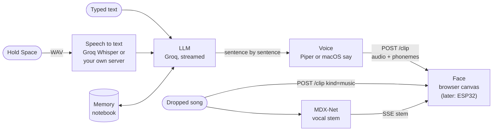

<div align="center">

<picture>
  <source media="(prefers-color-scheme: light)" srcset="assets/hero-light.svg">
  
</picture>

# Eli

**A face for your LLM.** A little green-on-black robot that talks with real lips, looks at you,
dozes off when you ignore it, and sings along to your music.

<a href="#quick-start"></a>&nbsp;
<a href="#faces"></a>&nbsp;
<a href="#protocol"></a>&nbsp;
<a href="#roadmap"></a>

<br>


English · [Français](README.fr.md)

</div>

---

Eli is a talking face you can plug an LLM into. Hold <kbd>Space</kbd>, say something, and a tiny OLED-style face
answers out loud, its mouth shaped by the actual phonemes it speaks. Leave it alone and it glances around, hums,
yawns, and eventually falls asleep, snoring in time with its breathing. Drop a song on it and it dances on the beat,
then sings the isolated vocal line, eyes closing on the high notes.

Today it runs in your browser, served by a small Python stdlib server. Tomorrow the same face goes on an **ESP32**
with a 128×64 OLED: the brain only ever talks to the face over a [tiny HTTP protocol](#protocol), so swapping the
browser for a board is one URL.

## What it does

<table>
  <tr>
    <td align="center" width="33%"><br><b>Talks with real lips</b><br><sub>Mouth driven by the audio <i>and</i> Piper's phoneme alignments (visemes), 100 frames a second.</sub></td>
    <td align="center" width="33%"><br><b>Listens when you hold Space</b><br><sub>Push-to-talk, wide eyes, little nods. Talk over it and it stops and drops its answer.</sub></td>
    <td align="center" width="33%"><br><b>Sings and dances</b><br><sub>Drop a song: it bounces on the beat, isolates the vocals with an MDX model and sings along.</sub></td>
  </tr>
  <tr>
    <td align="center"><br><b>Gets sleepy</b><br><sub>Idle gestures, then drowsy, then asleep: breathing, Zzz and a synthesized snore.</sub></td>
    <td align="center"><br><b>Can be a cat</b><br><sub>Cat faces twitch their ears, meow on their own and purr in their sleep.</sub></td>
    <td align="center"><br><b>14 faces</b><br><sub>OLED pixels, blocks, beads, round line faces, neon, LED matrix, oscilloscope, cats.</sub></td>
  </tr>
</table>

**And also**

- **Streams its answers.** The LLM streams, and each sentence is voiced as soon as it ends: the first words come out while the rest is still being written.
- **Remembers you.** The conversation survives restarts, and after a quiet spell the LLM distils it into a plain-text notebook of durable facts (`memory/souvenirs.md`, one per line, edit it by hand if you like).
- **Introduces itself.** On first launch Eli asks your name and a few questions to get to know you.
- **Speaks English or French.** `ELI_LANG=auto` follows your browser's language (Settings → Language overrides it): the persona, the fixed sentences, the voice, the transcription and the wake word all switch.
- **Says English words properly.** In French, Eli's voice is French; English words wrapped in `[en]…[/en]` are spoken with English phonemes in the same voice, so song titles don't come out mangled.
- **Optional cat voice.** A higher-pitched filter that only applies while a cat face is on screen.
- **Your music library.** Plug in Navidrome or any Subsonic server, then say "Eli, play some Daft Punk" or pick a song in the **Library** (♪ in the dock, <kbd>M</kbd>): search, covers, shuffle. Eli dresses for the genre (shades and palm trees for tropical, lasers for electro…).
- **Karaoke.** While it sings, the line being sung and the next one show under the face (synced lyrics from [LRCLIB](https://lrclib.net)); the face moves up just enough for them, never shrinks. The player (in the bottom bar on a wide window, so it never covers the lyrics) lets you pause, seek, and go to the previous or next song (past the last one, a random pick). The bar hides after 2 s without the mouse. Turn on **continuous play** (⇄) and he keeps going with random songs
  when one ends. He announces the songs you pick ("Here's Maps, by Maroon 5"), which also covers the seconds his isolated voice needs to start.
- **Never stuck on a dead model.** If Groq retires the model Eli thinks with, he switches to one it still serves; Settings → Brain lists what your server offers so you can pick another.
- **Pick its color.** Green, white, blue or yellow, like the OLED screens you can buy, or any color: handy to choose a screen before ordering one.
- **One voice at a time.** Open Eli in a browser, the Mac app and a phone: the screen you last used speaks, the others go quiet.
- **Developer mode.** A live log of the page and the server, and a one-click diagnostic (secrets masked) to paste in an issue.
- **Scriptable from the terminal** with [`./send.sh`](#from-the-terminal), over the same protocol the ESP32 will use.

## Quick start

**On a Mac (Apple Silicon, macOS 13+):** download the `.dmg` from the [latest release](https://github.com/adrbn/eli/releases/latest),
drag Eli into Applications, open it. Nothing else to install: on first launch Eli asks for his voice (hear them all
instantly, only the one you keep downloads), a brain (a free Groq key, or your own local model) and the mic, then
introduces himself. Updates install themselves.

**From source**, anywhere: you need [`uv`](https://docs.astral.sh/uv/), a free [Groq API key](https://console.groq.com/keys), and `ffmpeg` if you want it to sing.

```bash
git clone https://github.com/adrbn/eli && cd eli
cp .env.example .env        # then put your GROQ_API_KEY in it
./run.sh
```

That's it. `http://127.0.0.1:5280` opens, Eli wakes up and introduces itself.
The first run downloads a Piper voice (~60 MB) and the vocal-separation model (~65 MB).
`./run.sh --no-open` starts the server without opening a browser.

> [!TIP]
> In Safari, **File › Add to Dock** turns Eli into a real app window. Browsers want one click before they play
> sound: if needed, a "click to wake Eli" banner shows up.

## Native apps

**macOS** (`apps/macos`, no Xcode project, needs the Xcode command-line tools):

```bash
apps/macos/build.sh             # → apps/macos/build/Eli.app running this repo's server, signed with your Developer ID
BUNDLE=1 apps/macos/build.sh    # self-contained: Python, server and ffmpeg inside the app
apps/macos/release.sh 0.2.0     # notarized DMG + Sparkle appcast, asks before publishing the GitHub release
```

`Eli.app` starts the server if nothing answers on the port (and stops it on quit, only if it started it), finds the
repo when the app sits inside it, otherwise asks for the folder once. It's a regular app (Dock, native menus, no
menu-bar icon) and Eli lives in one place at a time, from the **View** menu:

- **Window** <kbd>⌘1</kbd>: the full page, without the bezel.
- **Floating** <kbd>⌘2</kbd>: just the face, above your windows; drag it anywhere, it snaps to edges and corners,
  resize from the corner or with a pinch, double-click opens the window.
- **Notch** <kbd>⌘3</kbd>: on a MacBook with a notch, Eli sits in it. Hover to get the text field, the song controls,
  the lyrics and the settings.

Closing the window sends Eli to the notch (or to the floating face on Macs without one); <kbd>⌘Q</kbd> quits. The
**Music** menu opens the library (<kbd>⌘B</kbd>), plays/pauses (<kbd>⌘P</kbd>), goes to the previous or next song, stops the song or just his speech
(<kbd>⌘.</kbd>). The **Developer** menu toggles developer mode, copies the diagnostic (<kbd>⌥⌘D</kbd>), opens the
server log or the page in your browser, and reloads.
Server output goes to `~/Library/Logs/Eli/server.log`; another port: `defaults write com.adrbn.eli.mac port 5281`.
Keep `HOST` on `127.0.0.1` or `0.0.0.0`: the app talks to `127.0.0.1`.

**iPhone** (`apps/ios`, needs [`xcodegen`](https://github.com/yonaskolb/XcodeGen)): `cd apps/ios && xcodegen`, open
`Eli.xcodeproj`, pick your team, run. On first launch, type the address of the computer running Eli (e.g. its
Tailscale IP, `100.x.y.z:5280`). Its `HOST` in `.env` must be reachable from the phone (`0.0.0.0`, or that IP).
The app relays the server through `127.0.0.1` on the phone, so the microphone works over plain http.
Long-press with two fingers to change the address.

## Controls

| Input | What happens |
|---|---|
| Type in the bar, <kbd>Enter</kbd> | It thinks (eyes searching up), then answers out loud. <kbd>Enter</kbd> anywhere focuses the bar. |
| Start the message with `>` | It says your text verbatim, no LLM involved |
| Hold <kbd>Space</kbd> (or the mic button) | It listens; release to send: transcription → answer → voice |
| Say **"Eli, …"** (Settings → *Écoute permanente*) | Hands-free. A small offline model flags anything that sounds like its name; only those snippets are transcribed. "Eli" alone: it opens its eyes and waits for the rest |
| Talk while it talks | It stops and abandons its answer |
| Drop an audio file on the window | **Talk** zone: the mouth follows the voice. **Sing** zone: it dances, then sings the isolated vocals |
| Move the mouse | Its gaze follows you (that's the simulated sensor) |
| <kbd>←</kbd> / <kbd>→</kbd> | Previous / next face |
| <kbd>V</kbd> | Settings → Faces: the gallery, with the "custom" face's settings |
| <kbd>M</kbd> | The library: search, shuffle, click to sing (server settings live in Settings → Music) |
| <kbd>P</kbd> | Play / pause the song |
| <kbd>C</kbd> | Show / hide the lyrics (also a button in the player) |
| <kbd>↑</kbd> / <kbd>↓</kbd> | Recall previously sent messages, like a shell |
| <kbd>Esc</kbd> | Closes panels and shuts it up (the song keeps playing, even one still downloading) |
| Click outside a panel | Closes it |
| Do nothing for 2 min | It gets drowsy, then falls asleep a minute later; anything wakes it |

**Settings** (bottom right) is one sheet with a sidebar: **General** (language, morning brief, stop talking, forget
the conversation), **Voice & listening** (voice, always listening, cat voice, volume, mouth lead time), **Faces**
(gallery, custom face, color, subtitles, mouse gaze, sleep sounds), **Music** (server, outfits by genre, music
notes, playing your own file), **Brain** (Groq key or your own server, and the model), **Memory** (the notebook,
replay the intro, forget everything) and **Developer**.

## Your music (Navidrome / Subsonic)

Eli plays from your own library through the [Subsonic API](https://www.subsonic.org/pages/api.jsp), so
[Navidrome](https://www.navidrome.org), Airsonic, Gonic or any Subsonic-compatible server works.

1. Open **Settings → Music** (or press ♪ in the dock, or just ask "Eli, play some jazz": until a server is set up,
   both open this form for you).
2. Enter the server address (`http://your-server:4533`), user and password. Eli checks them with `ping`, then keeps
   only a salted token (`md5(password + salt)`, as the Subsonic protocol wants) in `local/navidrome.json`, never the
   password. The token stays on the server: the page gets covers and songs through Eli, not from Navidrome.
3. From then on ♪ (or <kbd>M</kbd>) opens the **Library**: search by title, artist or album, or hit **Shuffle**;
   click a song and Eli sings it. By voice, "Eli, play Get Lucky"
   or "put on some Daft Punk" work too, including duets ("Arijit Singh and Martin Garrix").

In **Settings → Music**, the **Server** section shows the address, account and server version, **Test** measures the round trip, and
**Disconnect** deletes the token. Songs stream over your network, so a slow link (a phone tethered over Tailscale,
say) means a few seconds before he starts.

## Faces

Same behaviour, different renderers. Your pick is remembered and synced across open pages.

| Family | Id | Look | Target screen |
|---|---|---|---|
| Pixel | `pixel` *(default)* | every pixel of a 128×64 OLED | 0.96″ / 1.3″ OLED |
| Pixel | `blocs` | chunky square pixels | 128×64 OLED |
| Pixel | `perles` | plus-shaped pixels | 128×64 OLED |
| Pixel | `perles-fond` | round LEDs, unlit ones stay visible | colour screen |
| Pixel | `grille` | custom: density, shape (square / bead) and background | colour screen |
| Line | `trait` | round eyes, drawn lips | round 240×240 |
| Line | `trait-doux` | soft rounded-rectangle eyes, filled | round 240×240 |
| Line | `trait-contour` | the same, outlined | round 240×240 |
| Line | `trait-neon` | glowing outlines | round, ideally AMOLED |
| Cats | `chat-pixel` | pixel cat, twitching ears | 128×64 OLED |
| Cats | `chat-perles` | bead cat on visible LEDs | colour screen |
| Cats | `chaton` | kitten with big eyes and pink cheeks | round 240×240 |
| Others | `matrice` | 19×19 round-LED matrix | round 240×240 |
| Others | `oscillo` | oscilloscope trace, the mouth is a waveform | 4:3, 320×240 |

Cat faces meow now and then (synthesized, no samples) and purr instead of snoring.

<details>
<summary><b>Add your own face</b></summary>

<br>

Add an entry to `THEMES` in [`web/js/themes.js`](web/js/themes.js):

```js
{ id: 'mine', name: 'Mine', family: 'Others', screen: 'rect', note: 'what it looks like', make: () => draw }
```

`screen` is `rect` (2:1), `round` (1:1) or `wide` (4:3). `make()` returns a drawing function
`(ctx, W, H, f, dt)` called every frame. `f` holds the whole face state, and the face behaviour never depends on the renderer:

- `f.eyes = { gx, gy, open, hap, sc, bo }`: gaze, openness, happy-eye amount, scale, bounce
- `f.mouth = { o, w, r, t }`: opening, width, roundness, teeth
- `f.T`: time in seconds

On the ESP32, a face will be exactly this: one drawing function.

</details>

<details>
<summary><b>Faces as files (<code>.eliface</code>)</b></summary>

<br>

Every face except `oscillo` also exists as a small JSON file in [`web/faces/`](web/faces): shapes (rect, ellipse,
segment, triangle, arc, region) whose sizes and positions are formulas of the face state (`gx`, `open`, `hap`,
`o`, `T`…). A file can't run code: formulas only know arithmetic, comparisons and a few math functions.
Open the page with `?faces=format` to draw every theme from its file instead of its code, and
[`web/tests/compare.html`](web/tests/compare.html) to see both side by side. Pixel, Chat pixel and Matrice match their
code cell for cell over hundreds of states (`web/tests/faceparity.test.mjs`). The format is described in
[`docs/superpowers/specs/2026-10-02-face-format-design.md`](docs/superpowers/specs/2026-10-02-face-format-design.md);
it is the base for sharing faces and running them on the ESP32 without reflashing.

</details>

## How it works



- **Server** (`server/`, Python stdlib + Piper + onnxruntime): `app.py` holds the face protocol, `brain.py` the mic → transcription → LLM → voice loop, `voice.py` Piper (fallback: macOS `say`), `stems.py` + `mdx.py` the vocal separation, `memory.py` the conversation and notebook, `meow.py` synthesized meows.
- **Lip sync** (`web/js/analysis.js`, in a worker): each clip is analysed in full before it plays. Five frequency bands give opening, width, roundness (o, oo) and teeth (s, sh, f) at 100 frames a second; when the voice provides phoneme timings (Piper does), visemes built from them take over. The mouth reads the track at the time you *hear* (output latency included), 50 ms early like a real speaker.
- **Gaze** (`web/js/face.js`): it looks away when starting a sentence, comes back to you when finishing it, blinks in pauses, makes small saccades. Without a sensor, centred eyes look at everyone at once.
- **Music**: tempo and beats come from spectral flux and autocorrelation. Meanwhile MDX-Net (UVR's Kim_Vocal_2, ONNX, on CPU) isolates the vocals block by block while the song plays (about playback speed on an M1), so it sings from the first listen. High notes lift and squint the eyes, low notes drop the gaze. Results are cached by file hash.
- **Sleep sounds** (`web/js/sleep.js`): snore and purr are synthesized in the browser, locked to the face's breathing.

## Protocol

The face is a passive screen: you send it audio clips and states, it plays and animates.
The brain only talks to it through these routes, so replacing the page with an ESP32 means putting its address in `FACE_URL`.

```text
POST /clip?kind=speech|music&turn=N&name=f.mp3   body = audio file
                                                  X-Text: spoken text (URL-encoded)
                                                  X-Phonemes: [[phoneme, ms], …] as URL-encoded JSON (optional)
POST /stop    {} or {"turn": N}                   stop talking, clear the queue; then ignore clips from turns < N
              {"keep": "music"}                   …but let the current song play on
POST /state   {"mode": "idle|listen|think"}       background mood
POST /gaze    {"x": -1..1, "y": -1..1} or {}      gaze target (the sensor); {} frees the gaze
POST /theme   {"id": "pixel"}                     switch face
GET  /events                                      SSE stream to the display
GET  /clips/<id>, /stems/<hash>.wav               audio bytes (/clips/<id>?compat=1: transcoded to MP3;
                                                  /stems: isolated vocals, partial while still computing)
```

SSE events: `hello` (full state on connect), `clip`, `stem` (a song's isolated vocals are ready, block by block),
`lyrics` (synced lines for a song), `genre` (its outfit), `state`, `gaze`, `theme`, `voice`, `lang`, `take`, `music`,
`setup`, `stop` and `brain` (conversation steps, for display: `stt`, `heard`, `llm`, `music`, `fetch`, `done`,
`error`).

**Turns.** Every answer from the brain starts with `POST /stop {"turn": N}`. The screen goes quiet and drops any clip
still in flight from earlier turns, so an interrupted answer never comes back to talk over the next one.

The brain, served by the same process:

```text
POST /brain/listen   body = mic WAV          → transcription → answer → voice
POST /brain/chat     {"text": "…"}           → answer → voice
POST /brain/speak    {"text": "…"}           → voice only (says exactly this)
POST /brain/reset    (?all=1: notebook too)  forget the conversation
POST /brain/intro                            the get-to-know-you intro
POST /brain/meow                             one meow (cat faces)
POST /voice          {"id": "…"} / {"cat": true}   pick a voice / toggle the cat filter
POST /lang           {"lang": "en|fr"}       the page's language (voice, intro, brief)
POST /take           {"client": "…"}         this screen speaks now, the others go quiet (event "take")
GET  /api/status, /api/voices, /api/memory
GET  /api/logs?after=N                       the server's recent log lines (developer mode)

POST /music/setup    {"url", "user", "password"}   connect a Subsonic server (only a token is kept)
POST /music/forget   POST /music/ping              disconnect / test the server
POST /music/play     {"id": "…"}             sing this library song (he announces it first)
POST /music/prev     POST /music/next          the songs sung, back and forth (a random one past the end)
GET  /api/music, /api/music/songs?q=…        status / search (empty q = random songs)
GET  /music/cover/<id>                       album art, proxied
```

The server listens on `127.0.0.1` only. For an ESP32 on your network, set `HOST=0.0.0.0`; unknown host names and
cross-site requests are already refused.

## From the terminal

```bash
./send.sh dis "Bonjour !"          # say this verbatim
./send.sh demande "Ça va ?"        # ask the LLM, hear the answer
./send.sh parle voice.wav          # play a file, the mouth follows
./send.sh chante song.mp3          # dance and sing
./send.sh regarde 0.6 -0.2         # point the gaze (x, y in -1..1); no values = free gaze
./send.sh visage trait-neon        # switch face
./send.sh humeur think             # mood: idle, listen or think
./send.sh stop                     # stop talking
./send.sh oublie                   # forget the conversation
```

`ELI_URL=http://…` targets another server. (The verbs are French: *dis* = say, *demande* = ask, *parle* = talk,
*chante* = sing, *regarde* = look, *visage* = face, *humeur* = mood, *oublie* = forget.)

## Configuration

Everything lives in `.env` (template: [`.env.example`](.env.example)). Eli needs one brain: `GROQ_API_KEY` (free tier, your own key) or `LLM_URL`.

| Variable | Default | What it does |
|---|---|---|
| `GROQ_API_KEY` | | transcription and LLM |
| `STT_PROVIDERS` | `groq,echo` | transcription order, the next one takes over on failure |
| `ECHO_URL`, `ECHO_API_KEY` | | your own OpenAI-compatible `/v1/audio/transcriptions` server (e.g. Parakeet at home) |
| `ELI_LANG` | `auto` | the language Eli speaks: `en`, `fr`, or `auto` (the page's browser language; Settings → Language overrides it) |
| `STT_LANGUAGE` | *(follows `ELI_LANG`)* | transcription language, if it must differ |
| `LLM_MODEL`, `LLM_FALLBACK_MODEL` | `openai/gpt-oss-120b`, `openai/gpt-oss-20b` | Groq models |
| `LLM_URL`, `LLM_API_KEY` | | a local OpenAI-compatible brain instead (mlx_lm.server, Ollama…) |
| `TTS`, `SAY_VOICE` | `piper`, `Thomas` | starting voice (Siwis in French, Kristin in English); switch live in Settings, one choice per language |
| `SEPARATOR_MODEL` | `voices/Kim_Vocal_2.onnx` | the vocal-isolation model |
| `HOST`, `PORT` | `127.0.0.1`, `5280` | where the server listens |
| `FACE_URL` | *(this server)* | where the brain sends clips: later, the ESP32 |
| `BRIEF_CITY` | | city for the morning brief's weather (Open-Meteo, no key) |
| `ALLOWED_HOSTS` | | host names served besides IPs and localhost (e.g. behind `tailscale serve`) |
| `NAVIDROME_URL`, `_USER`, `_PASSWORD` | | your music library; easier from the Music panel |
| `LYRICS` | `on` | synced lyrics from LRCLIB while he sings (`off` = never ask) |

Eli's personality is `DEFAULT_PERSONA` in `server/brain.py` (one per language); drop a `persona.txt` at the repo root to replace it (it is used in both languages, and Eli is told which language to answer in).

## Run it on a home server (Docker)

The same server runs on a NAS or a mini PC (Linux, amd64 or 64-bit arm64), and every phone, tablet or laptop at home
opens the face in its browser.

```bash
git clone https://github.com/adrbn/eli && cd eli
cp .env.example .env              # put your GROQ_API_KEY in it
mkdir -p voices memory cache local  # created by you, so the container (uid 1000) can write to them
docker compose up -d --build
docker compose logs -f            # wait for "voice: piper · Siwis" then "Eli listening on …"
```

- The first start downloads the Piper voice and the vocal-separation model (~130 MB) into `voices/`. Coming from a Mac,
  copy your `memory/` folder over first (and `voices/` to skip the downloads): Eli picks up where it left off.
- Not uid 1000 on the host? Add `ELI_UID=…` and `ELI_GID=…` (from `id -u` and `id -g`) to `.env`.
- Keep `TTS=piper`, and delete `voices/choix.txt` if it names a `say:` voice: macOS voices don't exist on Linux.
- **Singing is CPU-heavy**: isolating a song's vocals runs an ONNX model on 4 threads that peaks around 2.5 GB of RAM
  (an M1 takes ~0.8× the song's length; a small CPU can fall behind playback). `SEPARATOR_MODEL=off` in `.env` turns
  it off (Eli still dances), and the memory limit in `compose.yaml` can then come down to 1 GB.
- Eli has **no login**: anyone who reaches the port can make it talk and read its notebook. Keep it on your LAN or VPN,
  never port-forward it to the internet.

**From a phone or tablet**, open `http://<server-ip>:5280`, on the LAN or through a VPN such as Tailscale or WireGuard.
Use the IP address: Eli only answers to IP addresses and `localhost` (a guard against DNS rebinding), so a hostname like
`nas.local` gets a 403.

Over plain `http://`, everything works except the **microphone** (hold-to-talk and the wake word): browsers only allow
`getUserMedia` in a secure context, meaning HTTPS or `localhost`. You can still type. For the microphone, put HTTPS in
front of Eli, on the same IP:

- **A reverse proxy with TLS**, for instance [Caddy](https://caddyserver.com) with its own local certificate authority.
  It keeps the browser's `Host` header, which Eli checks against `Origin`:

  ```caddy
  # your server's LAN or VPN IP; reverse_proxy eli:5280 if Caddy runs in the same compose project
  https://192.168.1.50:5443 {
      tls internal
      reverse_proxy 127.0.0.1:5280
  }
  ```

  Then install Caddy's root certificate (`pki/authorities/local/root.crt` in Caddy's data folder) on each device once
  and trust it, and open `https://192.168.1.50:5443`.
- **`tailscale serve`** gives a real certificate with no setup, on a `*.ts.net` hostname. Eli only serves IP addresses
  and `localhost` by default (DNS-rebinding guard), so name it in `.env`: `ALLOWED_HOSTS=eli.your-tailnet.ts.net`.
- For a quick test, Chrome (desktop and Android) can treat one origin as secure:
  `chrome://flags/#unsafely-treat-insecure-origin-as-secure`.

## Towards the ESP32

- **Board**: ESP32-S3 with PSRAM (audio buffers), a MAX98357A I2S amp and a small speaker.
- **Screen**: SSD1306 / SH1106 128×64 OLED for the Pixel family (`pixel`, `blocs` and `perles` fit pixel for pixel). Round GC9A01 240×240 for the line faces and the matrix. AMOLED for neon and the visible-LED faces.
- **Mouth**: the plan is for the server to compute the mouth track (the same `analysis.js`) and ship it with the clip; the board then just plays the sound and reads the track at 100 fps.
- **Gaze**: an LD2450 mmWave radar gives people's x/y without a camera; a camera with face detection works too. Either way: `POST /gaze`.

## Hardware / ESP32

[`firmware/esp32/`](firmware/esp32/) is a PlatformIO firmware that makes an ESP32-S3 (with PSRAM) a drop-in face. It
answers `/clip`, `/stop`, `/state`, `/gaze` and `/theme`, so you only have to set `FACE_URL=http://eli.local`. It
draws the Pixel family on a 128×64 OLED (recommended: the green 2.42" SSD1309), speaks through a MAX98357A with the
mouth following the phonemes, and can turn its head on two servos and do push-to-talk with an INMP441. Its
[README](firmware/esp32/README.md) has the wiring, the shopping list (about €35–55 from AliExpress) and the servo
calibration. **The firmware has not been compiled or tried on hardware yet.** Music (MP3) isn't played on the
board.

## Roadmap

- [x] Browser simulator with the ESP32 protocol
- [x] Phoneme-driven lip sync, streamed answers, interruption
- [x] Singing on isolated vocals, dancing on the beat
- [x] Memory with consolidation, first-run intro
- [x] Cat faces, meows, purring
- [x] Karaoke with synced lyrics (LRCLIB)
- [x] Wake word: say "Eli, …" hands-free (local Vosk gate, then your STT confirms; Settings → always listening)
- [x] Emotions: the LLM tags its sentences ([joie], [colère]…) and the eyes and mouth act them out
- [x] "Eli, play some Daft Punk": your Navidrome/Subsonic library; Eli opens the right settings form the first time
- [x] Library: search, covers, shuffle, continuous play; server test and disconnect
- [x] Outfits by genre, with backdrops that stay behind the face
- [x] Local brain: any OpenAI-compatible server (`LLM_URL`, e.g. mlx_lm.server or Ollama)
- [x] Home-server version (Docker)
- [x] Morning brief
- [x] English and French, interface included
- [x] Native Mac app (window, floating, notch) and iPhone app
- [x] Developer mode: live logs and a diagnostic for bug reports
- [x] Pick Eli's color
- [x] Faces as declarative files (`.eliface`), pixel-exact with the code
- [ ] Community mods: share faces and characters in one click, skills through MCP
- [ ] ESP32 build + servo neck
- [ ] Several Elis talking to each other

## FAQ

<details>
<summary><b>What leaves my machine?</b></summary>

<br>

The face, the voice (Piper), the lip sync, the vocal separation and the memory are all local. Two things go to Groq by
default: your recorded question (for transcription) and the conversation (for the LLM). Set `STT_PROVIDERS=echo,groq`
with your own transcription server and your voice stays home, at the cost of ~2 s more wait.

</details>

<details>
<summary><b>Does it speak English?</b></summary>

<br>

Yes: set `ELI_LANG=en` (or leave `ELI_LANG=auto` with an English browser, or pick it in Settings → Language). Eli then answers
in English with an English Piper voice (Kristin by default, ~60 MB, downloaded on first switch), transcribes in
English and wakes on "Eli" with the English Vosk model. If your `.env` still says `STT_LANGUAGE=fr`, empty it so
transcription follows the language. In French, English words inside a sentence are pronounced properly through
`[en]` tags.

</details>

<details>
<summary><b>Can I use another LLM?</b></summary>

<br>

Any Groq-hosted model works through `LLM_MODEL`. The calls are plain OpenAI-format HTTP, so another compatible provider
is a matter of changing the `GROQ` base URL in `server/brain.py`.

</details>

<details>
<summary><b>Does it need a GPU?</b></summary>

<br>

No. Vocal separation runs on CPU through onnxruntime, about 1.8× faster than real time on an Apple-silicon Mac, one song
at a time, cached by file hash. Without `ffmpeg` or the model, Eli still dances, it just doesn't sing.

</details>

<details>
<summary><b>Mac only?</b></summary>

<br>

It's built and tested on macOS. The server is stdlib Python and Piper is cross-platform; on Linux use
`./run.sh --no-open` and open the page yourself. The `say` voices are macOS-only.

</details>

<details>
<summary><b>Known limits</b></summary>

<br>

- The first <kbd>Space</kbd> press opens the mic and can eat the first syllable; the mic then stays open 30 s.
- A hidden or minimized window freezes the animation (the sound keeps going).
- Some songs have no synced lyrics on LRCLIB: Eli says so once, the face stays where it is and the player just shows the title.
- Vocal isolation runs at about playback speed on an M1, slower when the Mac is busy. Until it catches up, his mouth
  follows the synced lyrics and the song's loudness (so no lyrics + no isolated voice yet = a closed mouth).
- Mic capture uses `ScriptProcessor`: deprecated but everywhere, to be swapped for an `AudioWorklet`.

</details>

## Reporting a bug

Settings → Developer mode shows a live log of the page and the server. **Copy diagnostic** (or <kbd>⌥⌘D</kbd> in the Mac
app) puts versions, settings and both logs on your clipboard, with keys and passwords masked: paste it in a
[bug report](https://github.com/adrbn/eli/issues/new?template=bug.yml).

## Tests

```bash
uv run python -m unittest discover server
node --test 'web/tests/*.test.mjs'
```

The README art is generated from the face code itself: `python3 assets/make_svgs.py`.

## License

[MIT](LICENSE) © 2026 adrbn

Downloaded at first run, under their own terms: the [Piper](https://github.com/rhasspy/piper) Siwis voice (SIWIS
French Speech Synthesis Database, CC BY 4.0), the Piper Kristin voice in English (trained on LibriVox recordings,
public domain; the other English voices offered, Cori, Norman, John and Joe, are public domain or CC0 too), the
[Vosk](https://alphacephei.com/vosk/models) small French and small US English models (Apache 2.0), and UVR's Kim_Vocal_2 vocal-isolation model (no license stated by its authors; set
`SEPARATOR_MODEL=off` to skip it). Weather data by [Open-Meteo.com](https://open-meteo.com/) (CC BY 4.0), free for
non-commercial use.
